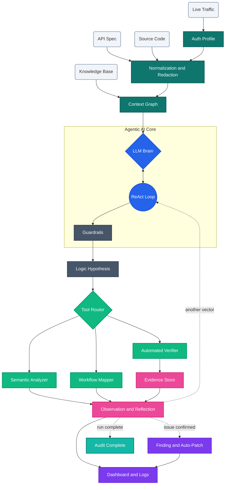

# Framework Principle

The diagram you shared is best treated as the framework work principle, not the full product flow.

This improved version expands the demo so it better represents how the framework should reason, act, observe, and publish results.

## What was added beyond the demo

- four-pillar data fusion instead of only two inputs,
- auth profiling and normalization before reasoning,
- a context graph that feeds the orchestrator,
- guardrails before tool execution,
- evidence capture separate from reflection,
- explicit dashboard publishing for non-security users.

## Repository mapping

- `backend/orchestrator/` implements the LLM brain and ReAct loop.
- `backend/proxy/` supplies live traffic capture.
- `backend/tools/analyzer/` implements semantic analysis.
- `backend/tools/workflow/` implements workflow mapping.
- `backend/tools/verifier/` implements PoC verification.
- `backend/api/routers/workflows.py` exposes a graph payload for the future frontend.
